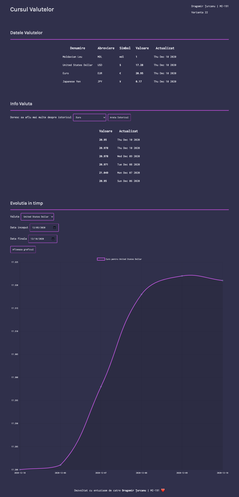

# Tema de acasa lul
Unecessary complex, but I'd like to try something new, so whatever

### API Stack:
___
- PHP 7.4
- MySQL 5.8
- Slim Framework
- Doctrine ORM

To define the configuration variables such as database credentials, please copy the contents of .env.example into .env and replace the values according to your system.

To run the dev project, please have nodemon installed:
```bash
npm i -g nodemon
```

And then run:
```bash
./dev_server.sh
```

To define the database schema, please run:
```bash
./db_update.sh
```

It will create / update the db structure for better usage.

### Front end stack
___
Here I took the philosophy of simpler is better and used no framework. My choise fell on Chart.js [https://www.chartjs.org/] when it came to graphs, and I'm quite satisfied with the result.



